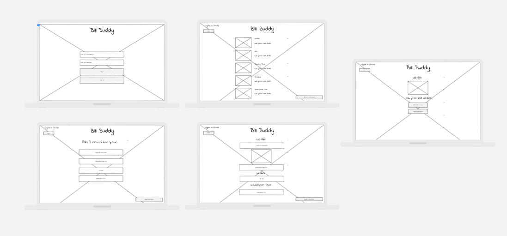
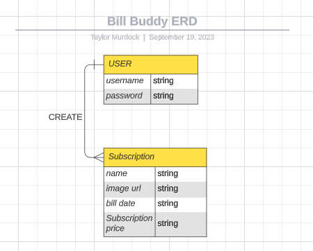

# Bill Buddy App

- [**LINK TO BACKEND GITHUB**](https://github.com/TaylorMurdock/bill_buddy_backend)
- [**LINK TO FRONTEND GITHUB**](https://github.com/TaylorMurdock/bill_buddy_frontend)
- [**LINK TO DEPLOYED WEBSITE**](https://billbuddy-frontend.onrender.com)

**List of technologies used:**

- React, JavaScript, Django

## About Bill Buddy

Bill Buddy is your trusted companion for keeping tabs on your monthly subscriptions. In a world where we're constantly signing up for streaming services, gym memberships, and more, it's easy to lose track of your expenses. With Bill Buddy, you can effortlessly manage your subscriptions in one place.

## Features

- **Add Subscriptions:** Easily add your subscriptions to Bill Buddy, providing key details like name, cost, and billing date.

- **Password Protection** Your financial data is important, and we take your privacy seriously. Bill Buddy offers robust security with our password protection feature. Set a secure password or PIN to keep your subscription list and financial information safe from prying eyes. Rest easy knowing that your financial data is for your eyes only..

- **Notifications** Stay on top of your bills effortlessly with Bill Buddy's built-in notification feature. Set reminders for upcoming subscription payments, and we'll make sure you never miss a due date again. Enjoy peace of mind knowing your finances are well-managed and in control.

## Why Choose Bill Buddy?

- **Streamlined Subscription Management** Bill Buddy simplifies the process of tracking and managing your subscriptions. With an intuitive interface, you can easily add, edit, or delete subscriptions in seconds. No more confusion or cluttered spreadsheets.

- **Never Miss a Payment Again** Our notification feature ensures you're always aware of upcoming subscription payments. Say goodbye to late fees and unexpected charges. Bill Buddy keeps you in the loop, so you can plan your finances with confidence.

- **Protect Your Financial Privacy** We understand the importance of financial privacy. Bill Buddy offers password protection, allowing you to safeguard your subscription list and sensitive financial information. Your data remains secure and confidential.

## How to Get Started

1. Clone the Bill Buddy repository to your local machine.
2. Install the required dependencies using [dependency manager].
3. Run the app on your preferred platform.
4. Sign up or log in to your Bill Buddy account.
5. Begin managing your monthly subscriptions by clicking the "Add Subscription" button.
6. Fill in the subscription details, including the name, cost, and billing date.
7. Set up notifications to receive reminders for upcoming payments.
8. For added security, you can enable password protection to keep your financial information private.
9. Stay organized and in control of your finances with Bill Buddy.

With Bill Buddy, you can effortlessly track and manage your subscriptions, ensuring your financial well-being is always on track.

## Contributions and Feedback

Contributions are welcome! If you have any suggestions, bug reports, or improvements, feel free to [open an issue](https://github.com/TaylorMurdock/bill_buddy_backend/issues) or [submit a pull request](https://github.com/TaylorMurdock/bill_buddy_backend/pulls). We believe in continuous improvement and value your input.

## About the Developer

Bill Buddy is the brainchild of Taylor Murdock, a passionate developer with a vision for simplifying subscription management. Taylor embarked on this journey to create an app that makes tracking subscriptions a breeze. With a background in web development and a dedication to enhancing financial organization, Taylor has crafted Bill Buddy to be an exceptional tool for anyone looking to take control of their monthly expenses.

- [Taylor Murdock](https://www.linkedin.com/in/taylor-murdock/)

Connect with me on LinkedIn to learn more about my backgrounds and stay updated on my latest projects!

---

Happy subscription tracking with Bill Buddy! Stay on top of your bills, manage your expenses, and enjoy financial peace of mind like never before.

## Mock Up of UI:

## List of Backend Endpoints:

| ENDPOINT                 | METHOD | PURPOSE                           |
| ------------------------ | ------ | --------------------------------- |
| /                        | GET    | Home Page                         |
| /login                   | POST   | Login Page                        |
| /register                | POST   | Register Page                     |
| /subscriptions           | GET    | List Of Subscriptions             |
| /subscription/:id        | GET    | View Specific Subscription        |
| /subscription/:id/edit   | GET    | Edit Specific Subscription        |
| /subscription/:id/edit   | POST   | Update Specific Subscription      |
| /subscriptions           | POST   | Delete Specific Subscription      |
| /subscription/:id        | POST   | Add New Subscription              |
| /subscription/:id/notify | POST   | Set Notification for Subscription |
| /logout                  | POST   | User Logout                       |

## ERD (entitity relationship diagram):

made with https://lucid.app.com

## Future Enhancements

- Payment History: Provide a payment history feature that shows users a record of their past subscription payments, helping them track their financial history.
- Multiple User Profiles: Allow multiple user profiles within a single Bill Buddy account, useful for households with shared subscriptions.